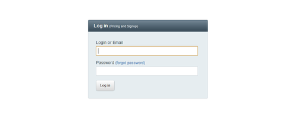
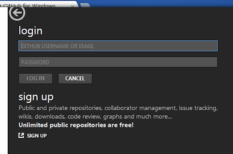
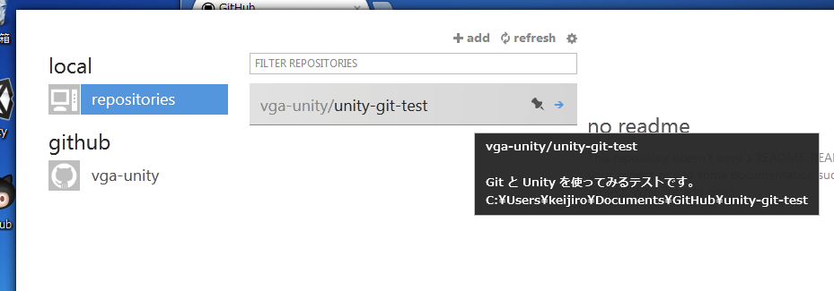
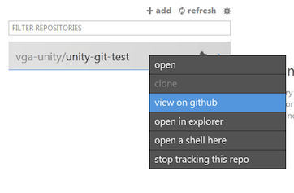
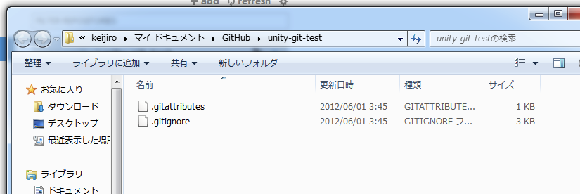

### まずは登録

まずは GitHub に登録してアカウントを取得します。<a href="http://github.com">GitHub のトップページ</a>から "Plans, Pricing and Signup" を押して登録ページへと移動してください。

"Free for open source" を選びましょう。 "Create a free account" を押します。

ユーザー名、メールアドレス、パスワードを入力して登録します。

メールアドレスに確認のメールが届きます。入力した情報を使ってログインしましょう。

こんな感じで、ホーム画面へ遷移するはずです。

### GitHub for Windows

GitHub は本来 Git を使うためのサービスですが、これをもっとシンプルに使いやすくしたツールを GitHub 自身がリリースしています。それが [GitHub for Windows](http://windows.github.com) です。

てきとうにインストールして立ち上げましょう。こんな感じになります。Metro 的な UI でカッコいいですね。

左側にある log in ボタンを押してログインします。先だって登録したメールアドレスとパスワードを入力してください。

ログインが完了したら、さっそく自分のリポジトリを作成してみましょう。上の方にある "+ add" ボタンを押します。

リポジトリの情報を入力する画面へ遷移します。リポジトリの名前と、簡単な説明文を入力します。

入力が完了したら "Create" ボタンを押してリポジトリを作成しましょう。

リポジトリの作成に成功すると、こんな感じで local 側にリポジトリが出現します。

リポジトリが GitHub 側にも作成されていることを確認してみましょう。右クリックメニューから "view on github" を選択します。

こんな感じで GitHub 側に自分の作成したリポジトリのページができていることを確認できます（中身はまだ空です）。

次に、ローカル側のリポジトリのありかも見てみましょう。右クリックメニューから "open in explorer" を選択します。マイドキュメントの GitHub 化にあるはずです。

今はまだ Git の設定ファイル (.gitignore, .gitattributes) しか存在しません。

